# Instant Payments PoC — Architecture Document

> **Version**: 1.0  
> **Date**: 2026-03-04  
> **Status**: Draft

---

## 1. Introduction

### 1.1 Purpose
This document describes the architecture of the **Instant Payments PoC** — a fraud-check pipeline for bank payments. The system validates, brokers, and fraud-screens payment transactions before approval or rejection.

### 1.2 Scope
Four independent microservices communicate via **ActiveMQ Artemis** (JMS), **REST APIs**, and **Debezium CDC** to process and audit payments:

- **Payment Processing System (PPS)** — Receives, validates, persists, and finalizes payments
- **Broker System (BS)** — Mediates between PPS and FCS, converts JSON ↔ XML
- **Fraud Check System (FCS)** — Screens payments against configurable blacklists
- **Audit Service (AS)** — Captures payment data changes via CDC and provides audit trail

### 1.3 Solution Variants

| Aspect | Solution 1 | Solution 2 |
|---|---|---|
| PPS ↔ BS | JMS/JSON messaging | REST API/JSON |
| BS ↔ FCS | JMS/XML messaging | JMS/XML messaging |
| Intra-system | JMS messaging | JMS messaging |

Both solutions share maximum code via **Spring Profiles** (`sol1`, `sol2`).

---

## 2. System Context Diagram

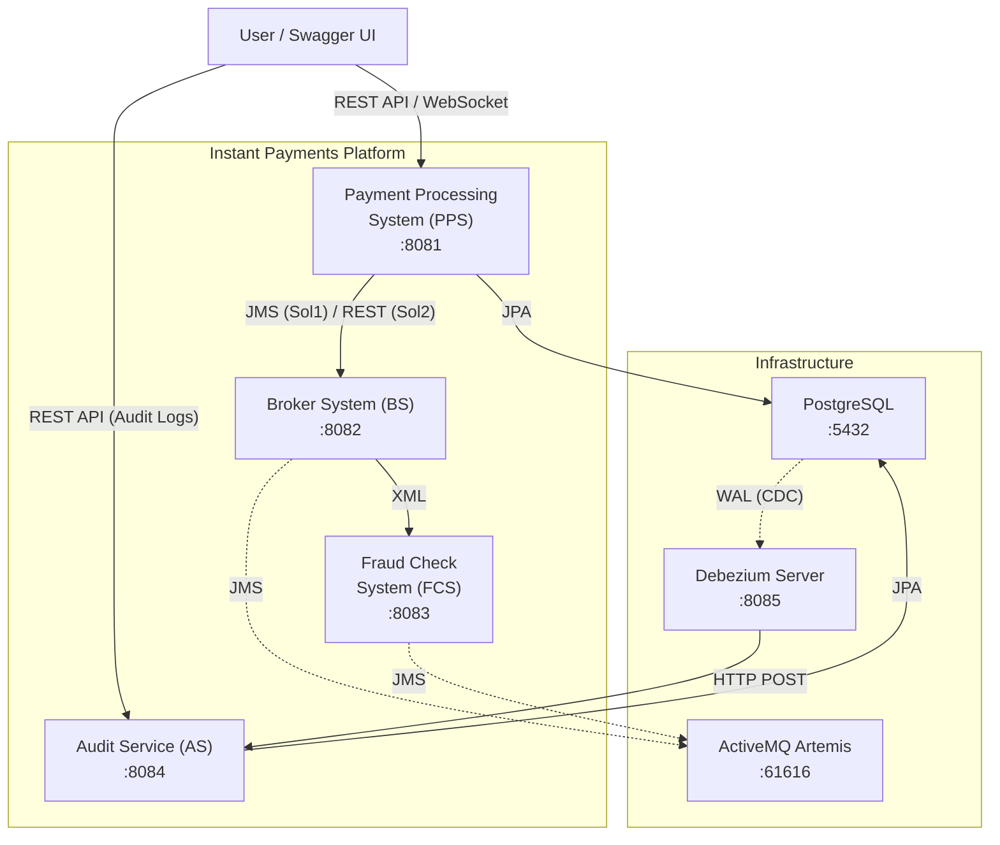

---

## 3. Component Architecture

### 3.1 Payment Processing System (PPS)

**Responsibilities:**
1. Receive payment requests (JSON) via REST API
2. Perform basic validation (ISO country codes, ISO currency codes, required fields)
3. Persist payments to PostgreSQL (status: `PENDING`)
4. Forward payment for fraud check (JMS queue for Sol1 / REST call for Sol2)
5. Receive fraud check results and update payment status (`APPROVED` / `REJECTED`)
6. Push real-time status updates to UI via WebSocket (STOMP)

> **Note:** Audit logging is **not** PPS's responsibility. Changes to the `payments` table are automatically captured via Debezium CDC and processed by the Audit Service (see §3.4).

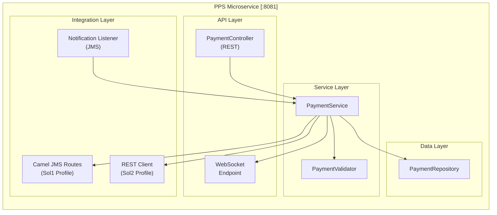

### 3.2 Broker System (BS)

**Responsibilities:**
1. Receive fraud check requests from PPS (JMS/JSON for Sol1, REST/JSON for Sol2)
2. Convert JSON payment payload → XML fraud check request
3. Forward XML request to FCS via JMS queue
4. Receive XML fraud check response from FCS
5. Convert XML response → JSON notification
6. Send JSON notification back to PPS via JMS queue

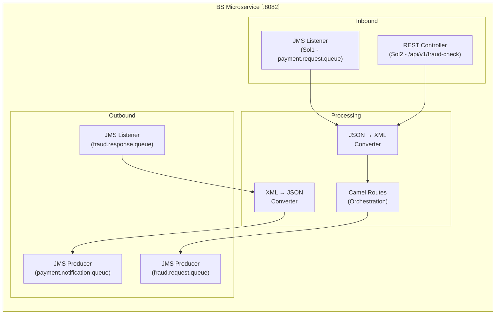

### 3.3 Fraud Check System (FCS)

**Responsibilities:**
1. Receive fraud check requests in XML from BS via JMS
2. Validate payment against configurable blacklists (names, countries, banks, payment instructions)
3. Return fraud check result (APPROVED/REJECTED) in XML via JMS

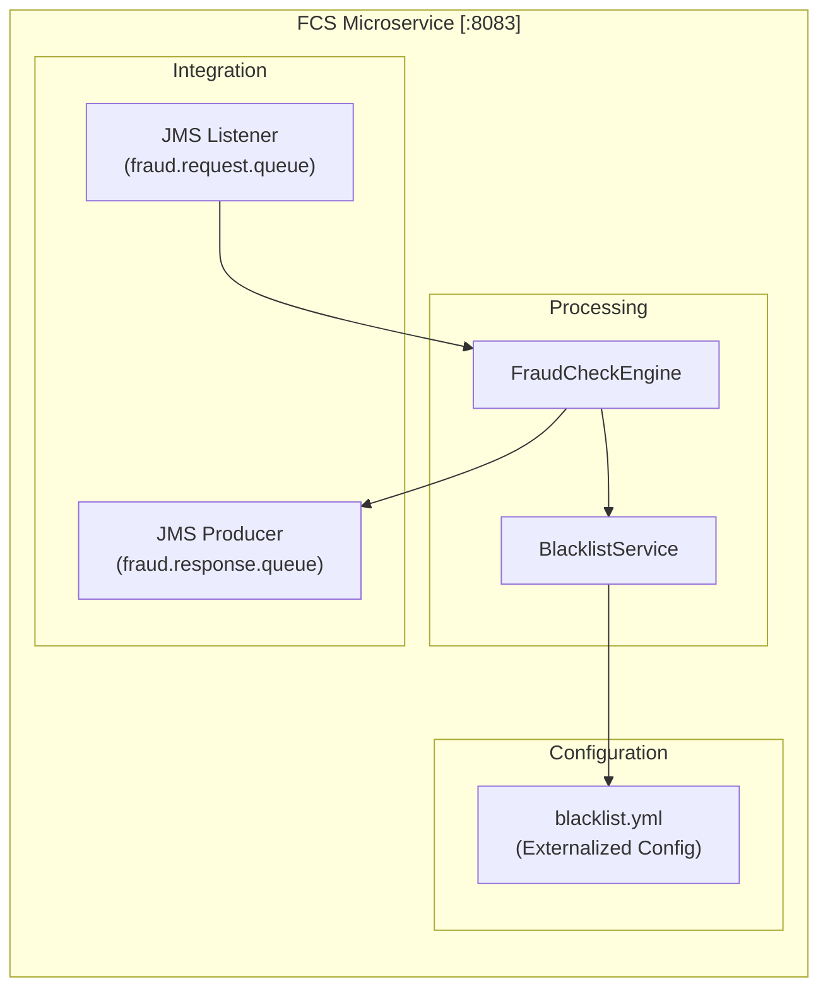

### 3.4 Audit Service (AS)

**Responsibilities:**
1. Receive CDC change events from Debezium Server via HTTP POST
2. Parse Debezium envelope (operation type, before/after row state)
3. Persist raw change records to `audit_logs` table
4. Expose REST API for querying audit history with filtering

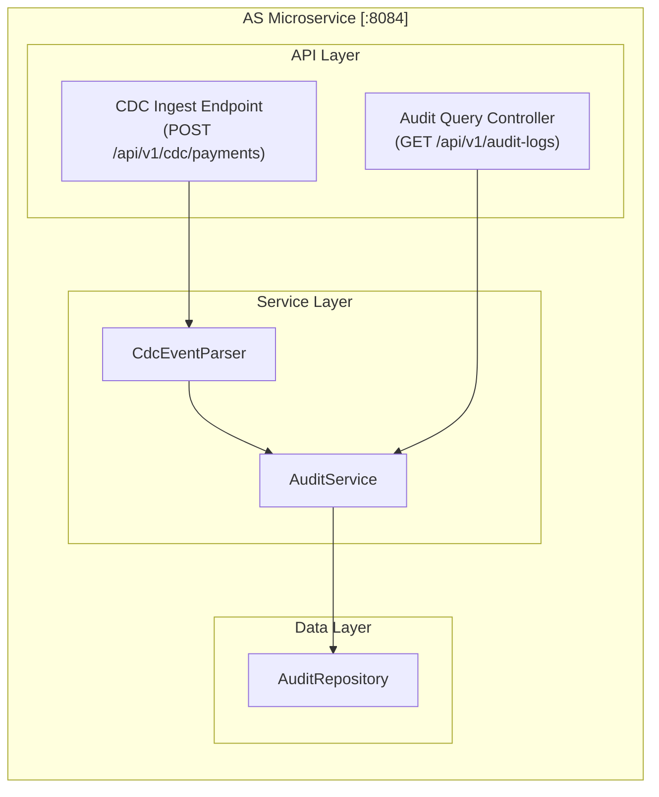

### 3.5 Debezium Server (CDC Infrastructure)

**Responsibilities:**
1. Connect to PostgreSQL via logical replication (WAL)
2. Monitor the `payments` table for INSERT, UPDATE, DELETE operations
3. Emit change events as JSON to the Audit Service via HTTP sink

**Configuration** (`application.properties`):
```properties
# Source — PostgreSQL
debezium.source.connector.class=io.debezium.connector.postgresql.PostgresConnector
debezium.source.database.hostname=postgres
debezium.source.database.port=5432
debezium.source.database.user=debezium
debezium.source.database.password=dbz_pass
debezium.source.database.dbname=instantpayments
debezium.source.table.include.list=public.payments
debezium.source.plugin.name=pgoutput
debezium.source.topic.prefix=cdc

# Sink — HTTP to Audit Service
debezium.sink.type=http
debezium.sink.http.url=http://audit-service:8084/api/v1/cdc/payments
debezium.sink.http.timeout.ms=5000

# Transforms
debezium.transforms=unwrap
debezium.transforms.unwrap.type=io.debezium.transforms.ExtractNewRecordState
debezium.transforms.unwrap.add.fields=op,table,source.ts_ms
debezium.transforms.unwrap.delete.handling.mode=rewrite
```

> **PostgreSQL prerequisite:** `wal_level` must be set to `logical` in `postgresql.conf`.

---

## 4. Data Flow Diagrams

### 4.1 Solution 1 — Full JMS Flow (PPS ↔ BS via Messaging)

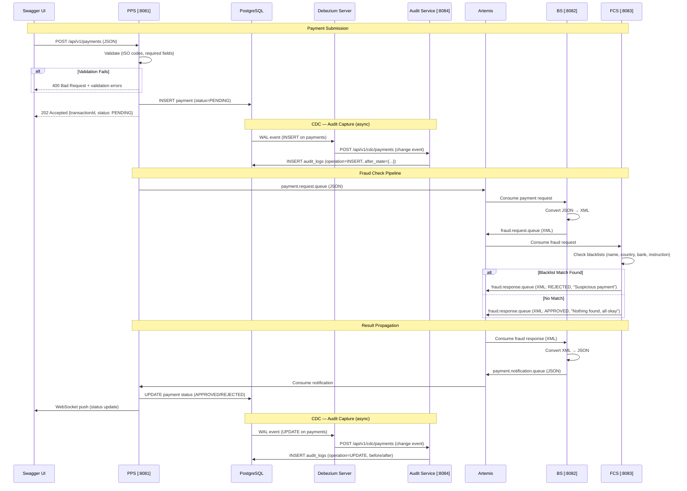

### 4.2 Solution 2 — REST + JMS Flow (PPS → BS via REST)

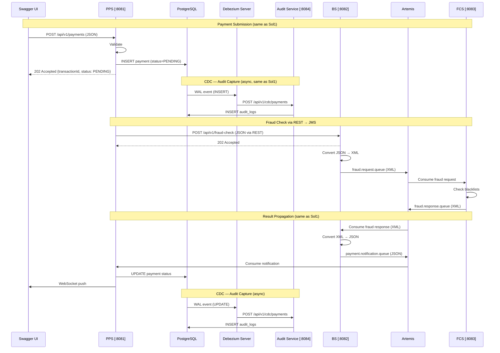

---

## 5. Data Models

### 5.1 Payment Payload (JSON — PPS Inbound/Outbound)

```json
{
  "transactionId": "550e8400-e29b-41d4-a716-446655440000",
  "payerName": "Munster Muller",
  "payerBank": "Bank of America",
  "payerCountryCode": "USA",
  "payerAccount": "1234567890",
  "payeeName": "John Doe",
  "payeeBank": "BNP Paribas",
  "payeeCountryCode": "DEU",
  "payeeAccount": "0987654321",
  "paymentInstruction": "Loan Repayment",
  "executionDate": "2026-03-04",
  "amount": 1500.00,
  "currency": "EUR",
  "creationTimestamp": "2026-03-04T12:30:00.000Z"
}
```

### 5.2 Fraud Check Request (XML — BS → FCS)

```xml
<?xml version="1.0" encoding="UTF-8"?>
<FraudCheckRequest xmlns="http://poc.instantpayments/fraud">
    <transactionId>550e8400-e29b-41d4-a716-446655440000</transactionId>
    <payer>
        <name>Munster Muller</name>
        <bank>Bank of America</bank>
        <countryCode>USA</countryCode>
        <account>1234567890</account>
    </payer>
    <payee>
        <name>John Doe</name>
        <bank>BNP Paribas</bank>
        <countryCode>DEU</countryCode>
        <account>0987654321</account>
    </payee>
    <paymentInstruction>Loan Repayment</paymentInstruction>
    <executionDate>2026-03-04</executionDate>
    <amount>1500.00</amount>
    <currency>EUR</currency>
</FraudCheckRequest>
```

### 5.3 Fraud Check Response (XML — FCS → BS)

```xml
<?xml version="1.0" encoding="UTF-8"?>
<FraudCheckResponse xmlns="http://poc.instantpayments/fraud">
    <transactionId>550e8400-e29b-41d4-a716-446655440000</transactionId>
    <outcome>APPROVED</outcome>
    <message>Nothing found, all okay</message>
    <checkedAt>2026-03-04T12:30:05.000Z</checkedAt>
</FraudCheckResponse>
```

### 5.4 Payment Notification (JSON — BS → PPS)

```json
{
  "transactionId": "550e8400-e29b-41d4-a716-446655440000",
  "outcome": "APPROVED",
  "message": "Nothing found, all okay",
  "checkedAt": "2026-03-04T12:30:05.000Z"
}
```

### 5.5 CDC Change Event (JSON — Debezium Server → Audit Service)

**INSERT event** (payment created):
```json
{
  "op": "c",
  "ts_ms": 1709554200000,
  "source": {
    "table": "payments",
    "db": "instantpayments",
    "lsn": 33495432
  },
  "before": null,
  "after": {
    "id": 1,
    "transaction_id": "550e8400-e29b-41d4-a716-446655440000",
    "payer_name": "Munster Muller",
    "payer_bank": "Bank of America",
    "payer_country": "USA",
    "payer_account": "1234567890",
    "payee_name": "John Doe",
    "payee_bank": "BNP Paribas",
    "payee_country": "DEU",
    "payee_account": "0987654321",
    "payment_instruction": "Loan Repayment",
    "execution_date": "2026-03-04",
    "amount": 1500.00,
    "currency": "EUR",
    "status": "PENDING",
    "fraud_message": null,
    "created_at": "2026-03-04T12:30:00.000Z",
    "updated_at": "2026-03-04T12:30:00.000Z"
  }
}
```

**UPDATE event** (status changed after fraud check):
```json
{
  "op": "u",
  "ts_ms": 1709554205000,
  "source": {
    "table": "payments",
    "db": "instantpayments",
    "lsn": 33495500
  },
  "before": {
    "id": 1,
    "transaction_id": "550e8400-e29b-41d4-a716-446655440000",
    "status": "PENDING",
    "fraud_message": null,
    "updated_at": "2026-03-04T12:30:00.000Z"
  },
  "after": {
    "id": 1,
    "transaction_id": "550e8400-e29b-41d4-a716-446655440000",
    "status": "APPROVED",
    "fraud_message": "Nothing found, all okay",
    "updated_at": "2026-03-04T12:30:05.000Z"
  }
}
```

**Operation codes:** `c` = INSERT, `u` = UPDATE, `d` = DELETE

---

## 6. Database Schema

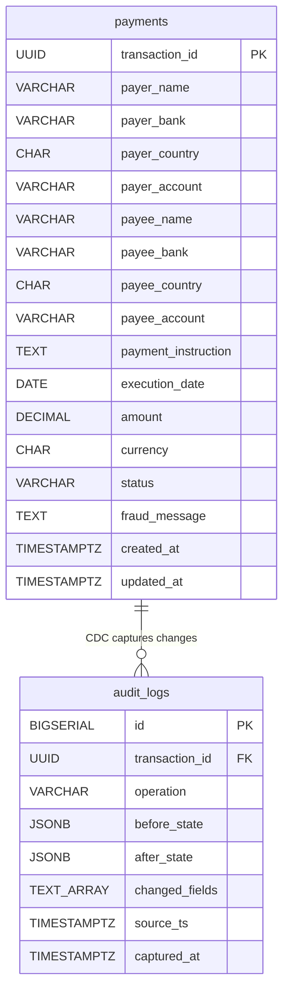

### 6.1 `payments` Table

```sql
CREATE TABLE payments (
    transaction_id  UUID            PRIMARY KEY,
    payer_name      VARCHAR(255)    NOT NULL,
    payer_bank      VARCHAR(255)    NOT NULL,
    payer_country   CHAR(3)         NOT NULL,
    payer_account   VARCHAR(50)     NOT NULL,
    payee_name      VARCHAR(255)    NOT NULL,
    payee_bank      VARCHAR(255)    NOT NULL,
    payee_country   CHAR(3)         NOT NULL,
    payee_account   VARCHAR(50)     NOT NULL,
    payment_instruction TEXT,
    execution_date  DATE            NOT NULL,
    amount          DECIMAL(15,2)   NOT NULL,
    currency        CHAR(3)         NOT NULL,
    status          VARCHAR(20)     NOT NULL DEFAULT 'PENDING',
    fraud_message   TEXT,
    created_at      TIMESTAMPTZ     NOT NULL DEFAULT NOW(),
    updated_at      TIMESTAMPTZ     NOT NULL DEFAULT NOW()
);

CREATE INDEX idx_payments_status ON payments(status);
```

### 6.2 `audit_logs` Table (CDC Pattern)

```sql
CREATE TABLE audit_logs (
    id              BIGSERIAL       PRIMARY KEY,
    transaction_id  UUID            NOT NULL,
    operation       VARCHAR(10)     NOT NULL,   -- INSERT, UPDATE, DELETE
    before_state    JSONB,                      -- null for INSERT
    after_state     JSONB,                      -- null for DELETE
    changed_fields  TEXT[],                     -- columns that changed (UPDATEs only)
    source_ts       TIMESTAMPTZ     NOT NULL,   -- DB commit time from Debezium
    captured_at     TIMESTAMPTZ     NOT NULL DEFAULT NOW()
);

CREATE INDEX idx_audit_transaction_id ON audit_logs(transaction_id);
CREATE INDEX idx_audit_operation ON audit_logs(operation);
CREATE INDEX idx_audit_source_ts ON audit_logs(source_ts);
```

> **Note:** `before_state` and `after_state` store full JSONB snapshots of the `payments` row, enabling before/after comparison in the UI.

### 6.3 PostgreSQL Configuration for CDC

```sql
-- Required: enable logical replication
ALTER SYSTEM SET wal_level = 'logical';

-- Create a replication user for Debezium
CREATE ROLE debezium WITH REPLICATION LOGIN PASSWORD 'dbz_pass';
GRANT SELECT ON ALL TABLES IN SCHEMA public TO debezium;

-- Ensure REPLICA IDENTITY is FULL for before-state capture
ALTER TABLE payments REPLICA IDENTITY FULL;
```

---

## 7. Messaging & CDC Topology

### 7.1 JMS Queues (ActiveMQ Artemis)

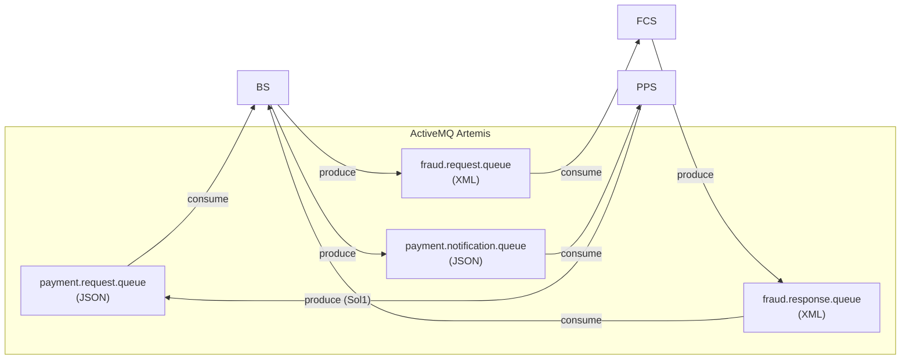

| Name | Type | Format | Producer | Consumer |
|---|---|---|---|---|
| `payment.request.queue` | Queue | JSON | PPS (Sol1) | BS |
| `fraud.request.queue` | Queue | XML | BS | FCS |
| `fraud.response.queue` | Queue | XML | FCS | BS |
| `payment.notification.queue` | Queue | JSON | BS | PPS |

### 7.2 CDC Flow (Debezium Server)

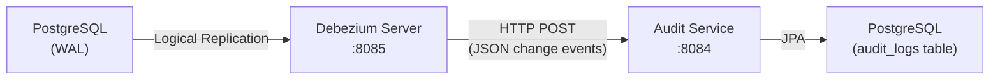

| Source | Mechanism | Format | Destination |
|---|---|---|---|
| `payments` table (WAL) | PostgreSQL logical replication | Debezium envelope (JSON) | Debezium Server |
| Debezium Server | HTTP POST | JSON change event | Audit Service (`/api/v1/cdc/payments`) |

---

## 8. Code Reuse Strategy (Spring Profiles)

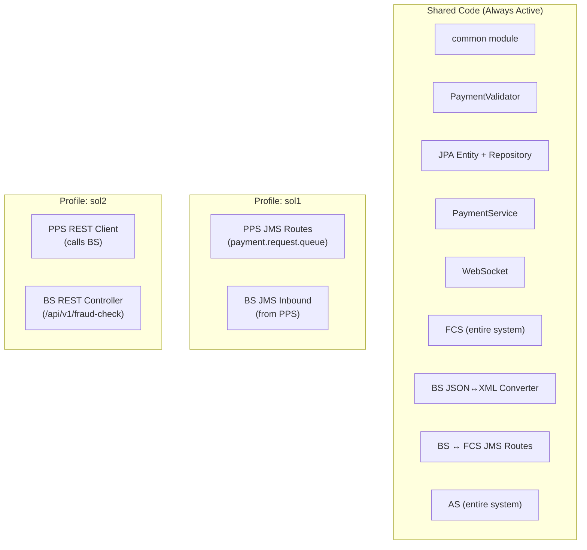

**Activation:**
```bash
# Solution 1 (full JMS)
java -jar pps.jar --spring.profiles.active=sol1
java -jar bs.jar --spring.profiles.active=sol1

# Solution 2 (REST + JMS)
java -jar pps.jar --spring.profiles.active=sol2
java -jar bs.jar --spring.profiles.active=sol2

# FCS — no profile needed (identical for both)
java -jar fcs.jar

# AS — no profile needed (standalone CDC consumer)
java -jar as.jar
```

---

## 9. Blacklist Configuration

Externalized via `blacklist.yml` in FCS, loaded as `@ConfigurationProperties`:

```yaml
blacklist:
  names:
    - "Mark Imaginary"
    - "Govind Real"
    - "Shakil Maybe"
    - "Chang Imagine"
  countries:
    - "CUB"
    - "IRQ"
    - "IRN"
    - "PRK"
    - "SDN"
    - "SYR"
  banks:
    - "BANK OF KUNLUN"
    - "KARAMAY CITY COMMERCIAL BANK"
  paymentInstructions:
    - "Artillery Procurement"
    - "Lethal Chemicals payment"
```

**Matching Logic:**
- Case-insensitive comparison on all fields
- Checks: payer name, payee name, payer country, payee country, payer bank, payee bank, payment instruction
- If **any** match → `REJECTED` with message `"Suspicious payment"`
- If **no** match → `APPROVED` with message `"Nothing found, all okay"`

---

## 10. Deployment Architecture

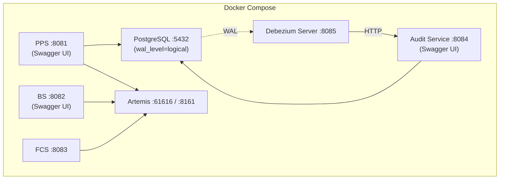

**Port Mapping:**

| Service | Port | Description |
|---|---|---|
| PostgreSQL | 5432 | Database (wal_level=logical) |
| Artemis (JMS) | 61616 | AMQP/OpenWire |
| Artemis (Console) | 8161 | Web management console |
| PPS | 8081 | Payment Processing System (Swagger UI: `/swagger-ui.html`) |
| BS | 8082 | Broker System (Swagger UI: `/swagger-ui.html`) |
| FCS | 8083 | Fraud Check System |
| Audit Service | 8084 | CDC Audit Service (Swagger UI: `/swagger-ui.html`) |
| Debezium Server | 8085 | CDC connector (PostgreSQL → HTTP) |

---

## 11. Technology Stack Summary

| Layer | Technology | Version |
|---|---|---|
| Language | Java | 17 |
| Build | Maven (multi-module) | 3.9+ |
| Framework | Spring Boot | 3.2.x |
| Integration | Apache Camel (Spring Boot Starter) | 4.x |
| Messaging | ActiveMQ Artemis | 2.31+ |
| CDC | Debezium Server (PostgreSQL connector) | 2.5+ |
| Database | PostgreSQL (wal_level=logical) | 15+ |
| ORM | Spring Data JPA / Hibernate | — |
| API Docs | SpringDoc OpenAPI (Swagger UI) | 2.x |
| Code Gen | OpenAPI Generator Maven Plugin | 7.4.0 |
| WebSocket | Spring WebSocket + STOMP | — |
| JSON | Jackson | — |
| XML | JAXB | — |
| Testing | JUnit 5, Mockito, Testcontainers | — |
| Coverage | JaCoCo (95% target) | — |
| Containers | Docker, Docker Compose | — |
| Logging | SLF4J + Logback (async) | — |

---

## 12. API-First Approach & Swagger UI

All service APIs follow an **API-first** development approach:

1. **OpenAPI specs** are the single source of truth (`docs/api/*.yaml`)
2. **OpenAPI Generator** (Maven plugin) generates Spring interfaces and DTOs at build time
3. Controllers implement the generated interfaces — ensuring spec-code consistency
4. **Swagger UI** is available on each service at `/swagger-ui.html`, rendering directly from the YAML spec

| Service | Swagger UI URL |
|---|---|
| PPS | `http://localhost:8081/swagger-ui.html` |
| BS | `http://localhost:8082/swagger-ui.html` |
| AS | `http://localhost:8084/swagger-ui.html` |
